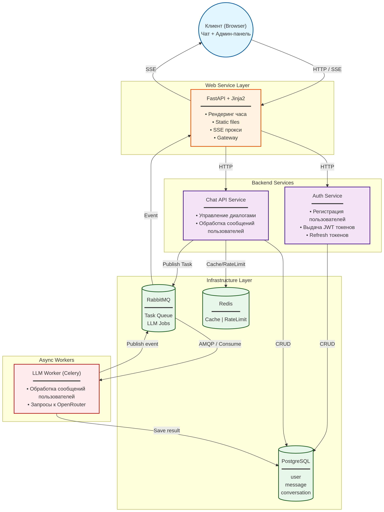

# Fullstack Web-Service

Чат-платформа с имитацией серверной логики мессенджера.

Архитектурная сложность: Вам потребуется реализовать систему из 7+ связанных компонентов:
* Auth Service: регистрация, JWT-токены (Access/Refresh), управление ролями.
* Web Service (FastAPI + Jinja): фронтенд чата, админ-панель и история диалогов.
* Chat API Service: бизнес-логика сообщений и статусов.
* Инфраструктура: Брокер очередей (RabbitMQ) + Celery Worker для LLM-задач.
* Хранение: PostgreSQL (БД) + Redis (кэш, Rate Limiting и стейты).

## Содержание:

1. [Общая логика](#общая-логика);
2. [Auth Service](auth_service/README.md);
3. [Chat API Service](chat_api_service/README.md);
4. [Web Service](web_service/README.md).

## Общая логика

Пользователи взаимодействуют с чатом через браузер, получая обновления по SSE (Server-Sent Events), в то время как 
тяжелые задачи (общение с OpenClient / LLM) вынесены в отдельные воркеры и используют очередь сообщений. 
Присутствует разделение на клиентскую часть, слой веб-сервисов, слой бэкенд-сервисов, инфраструктурный слой и воркеры.

### Клиент (Browser)

**Роли**: Чат (для обычных пользователей) + Админ-панель.

**Взаимодействие**: Отправляет HTTP-запросы и подписывается на события через SSE.

###  Web Service Layer (FastAPI + Jinja2)

*Сервис: [Web Service](web_service/README.md)*

* Выступает в роли шлюза (Gateway).

* Рендеринг HTML-страниц (через Jinja2).

* Отдача статических файлов (CSS, JS).

* SSE прокси / Gateway – передаёт потоковые события от бэкенда к браузеру.

Принимает HTTP-запросы от клиента и маршрутизирует их к соответствующим бэкенд-сервисам.

### Backend Services (микросервисы)

**[Chat API Service](chat_api_service/README.md):** Управление диалогами, обработка входящих сообщений от пользователей.

**[Auth service](auth_service/README.md):** Регистрация пользователей, выдача и обновление JWT-токенов.

### Infrastructure Layer (инфраструктура)

**Redis:** Используется для кэширования (Cache) и для ограничения частоты запросов (RateLimit).

**RabbitMQ:** Брокер сообщений (Task Queue) служит для публикации задач на обработку LLM (очередь LLM Jobs). Воркеры 
забирают задачи из очереди по протоколу AMQP. Сюда же публикуются события (events) о завершении обработки сообщений.

### Async Workers (Celery)

**LLM Worker:** Слушает очередь (Consume), получает задачу, обрабатывает сообщение пользователя, 
выполняет запросы к OpenRouter.

После получения ответа сохраняет результат в БД и публикует событие в RabbitMQ.
