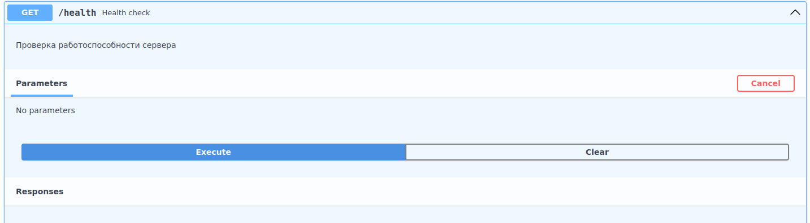
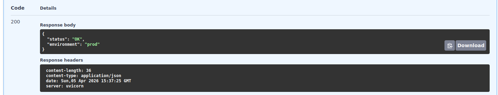

# Health check

Эндпоинт для мониторинга состояния сервиса и проверки его доступности.

## Request

**URL**: `GET /health`



**CURL**

```shell
curl -X 'GET' \
  'http://127.0.0.1:8000/health' \
  -H 'accept: application/json'
```

## Response

**200 - OK**

Успешный ответ.

