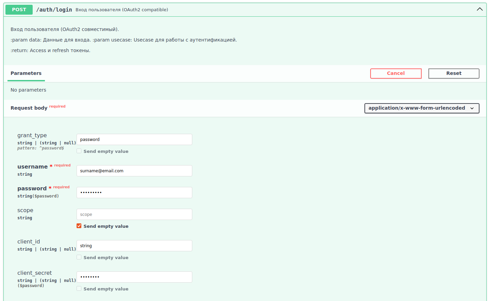
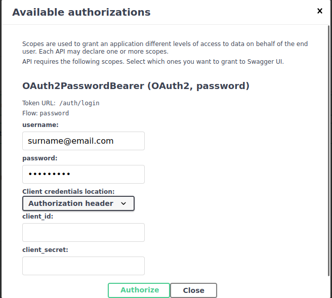
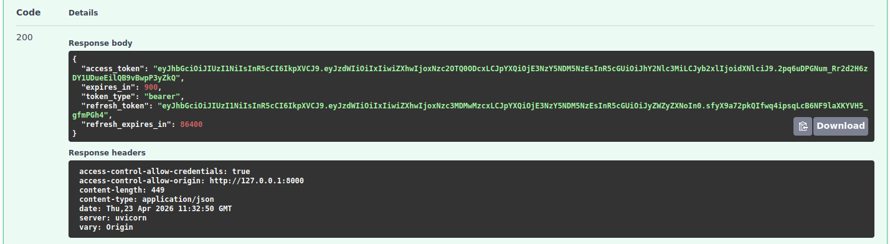
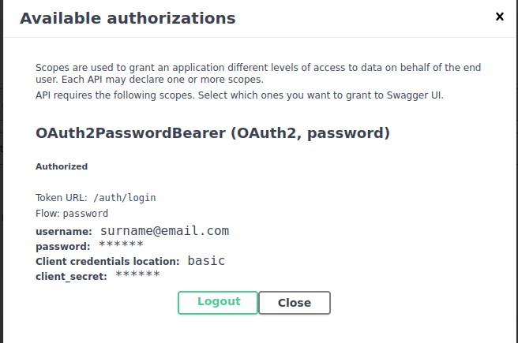
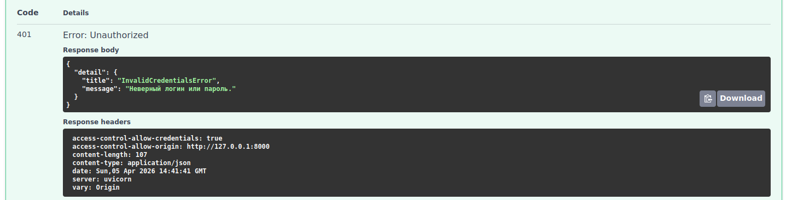

# Аутентификация пользователя

Эндпоинт для входа в систему и получения токена доступа. 
Реализован в соответствии со стандартом OAuth2.

## Request

**URL**: `POST /auth/login`

**JSON-body**:

| Параметр      | Тип     | Описание                                 | Значение по умолчанию | Обязательный |
|---------------|---------|------------------------------------------|-----------------------|--------------|
| username      | string  | Email пользователя                       | --                    | ✅            |
| password      | string  | Пароль пользователя                      | --                    | ✅            |
| grant_type    | string  | Тип авторизации                          | password              | ❌            |
| scope	     | string  | Области доступа (пробелами через пробел) | --          	      | ❌            | 
| client_id     | string  | Идентификатор клиента                    | --                    | ❌            |
| client_secret | string  | Секрет клиента                           | --                    | ❌            |



**Auth form**



**CURL**

```shell
curl -X 'POST' \
  'http://127.0.0.1:8000/auth/login' \
  -H 'accept: application/json' \
  -H 'Content-Type: application/x-www-form-urlencoded' \
  -d 'grant_type=password&username=surname%40email.com&password=P%40ssw0rd!&scope=&client_id=string&client_secret=********'
```

## Response

**200 - OK**:

Успешный ответ.

| Параметр           | Тип | Описание                              |
|--------------------|-----|---------------------------------------|
| access_token       | str | Access токен                          |
| expires_in         | int | Время жизни access токен в секундах   |
| token_type         | str | Тип токена                            |
| refresh_token      | str | Refresh токен                         |
| refresh_expires_in | str | Время жизни refresh токена в секундах |





**401 - Unauthorized**:

Указаны неверные учетные данные (email или пароль):


