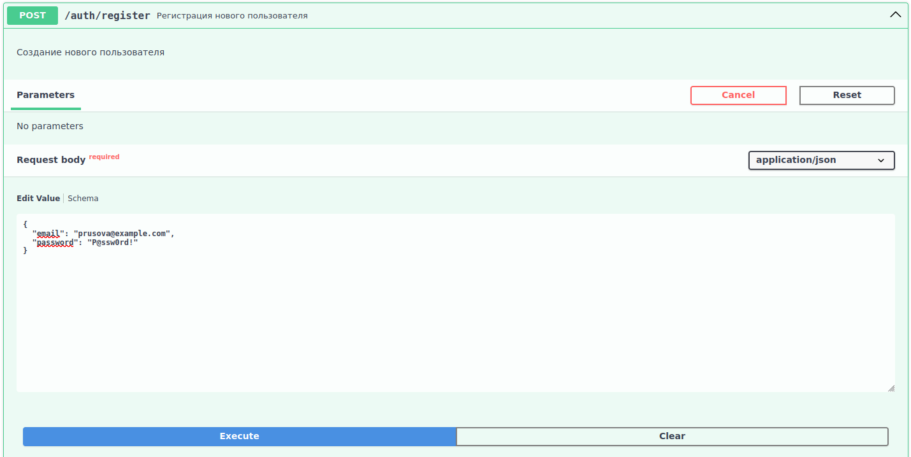
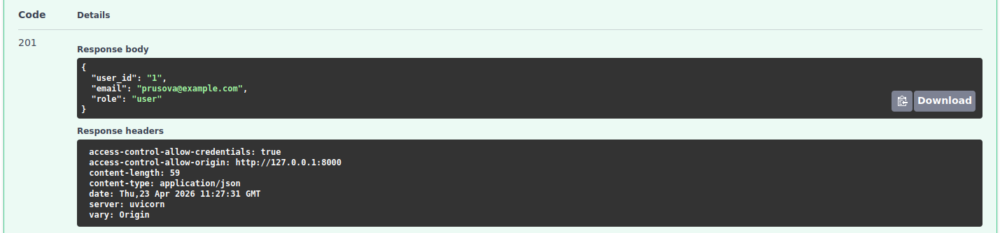
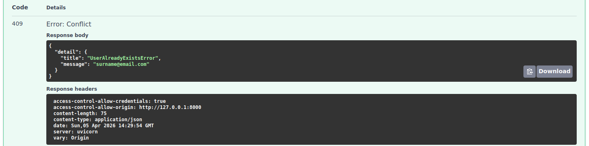

# Регистрация пользователя

ндпоинт для создания нового пользователя в системе.

## Request:

**URL**: `POST /auth/register`

**JSON-body**:

| Параметр | Тип | Описание            | Значение по умолчанию | Обязательный |
|----------|-----|---------------------|-----------------------|--------------|
| email    | str | Email пользователя  | --                    | ✅            |
| password | str | Пароль пользователя | --                    | ✅            |



**CURL**

```shell
curl -X 'POST' \
  'http://127.0.0.1:8000/auth/register' \
  -H 'accept: application/json' \
  -H 'Content-Type: application/json' \
  -d '{
  "email": "surname@email.com",
  "password": "P@ssw0rd!"
}'
```

## Response:

**201 - Created**:

Успешная регистрация.

| Параметр   | Тип  | Описание                                                         |
|------------|------|------------------------------------------------------------------|
| id         | int  | ID пользователя                                                  |
| email      | str  | Email пользователя                                               |
| role       | str  | Роль пользователя (всем пользователям присваивается роль `user`) |



**409 - Conflict**:

Если пользователь с указанным `email` уже существует.

