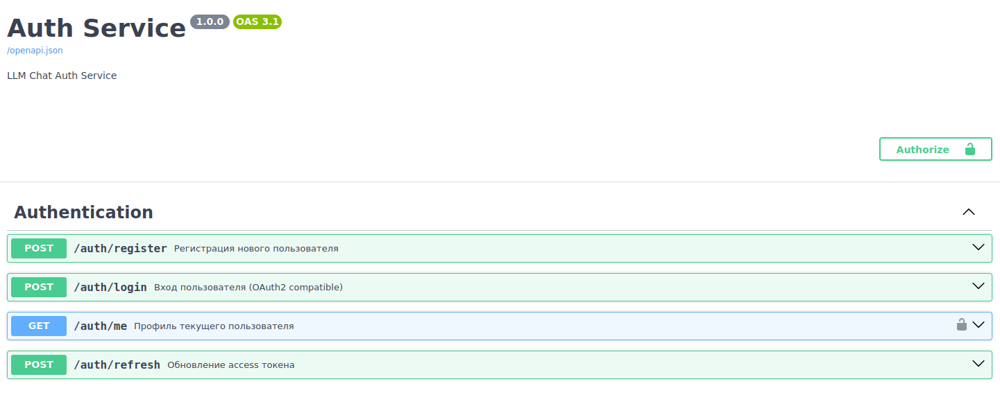

# Запуск проекта

## 1. Настройка виртуального окружения

`uv` — это быстрый менеджер пакетов и инструмент для управления виртуальными окружениями. 
Если uv еще не установлен, установите его с помощью команды:

```shell
curl -LsSf https://astral.sh/uv/install.sh | sh
```

### Инициализация виртуального окружения

Создайте и синхронизируйте виртуальное окружение с зависимостями проекта:

```shell
uv sync
```

Эта команда создаст виртуальное окружение и установит все зависимости, указанные в `pyproject.toml`.

## 2. Запуск сервера

Запустите сервер с помощью команды:

```shell
uv run uvicorn app.main:app --reload --host 0.0.0.0 --port 8000 --env-file .env
```

**Параметры запуска**

| Параметр | Описание                        | Значение по умолчанию |
|----------|---------------------------------|-----------------------|
| host     | Хост сервера                    | 127.0.0.1             |
| port     | Порт сервера                    | 8000                  |
| env-file | Путь к файла с настройками      | -                     |

При успешном запуске в терминале появятся логи, аналогичные следующим:

```shell
uv run uvicorn app.main:app --reload --host 0.0.0.0 --port 8000 --env-file .env

INFO:     Loading environment from './auth_service/.env'
INFO:     Started server process [62251]
INFO:     Waiting for application startup.
2026-04-05 17:17:30.712 | INFO     | auth_service.app.core.security.password:setup:26 - Установлен контекст для хеширования паролей
2026-04-05 17:17:30.760 | INFO     | auth_service.app.db.session:setup:60 - Инициализация класса DBSession завершена.
INFO:     Application startup complete.
INFO:     Uvicorn running on http://0.0.0.0:8000 (Press CTRL+C to quit)
```

После запуска сервера перейдите в браузере по хосту `http://localhost:8000/docs`:


