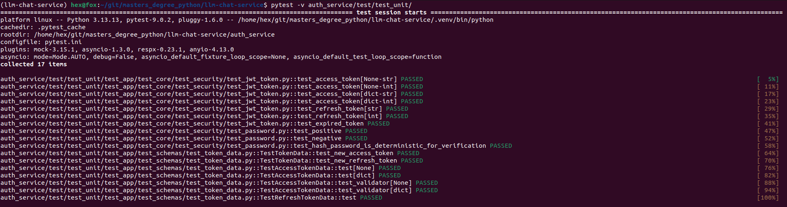
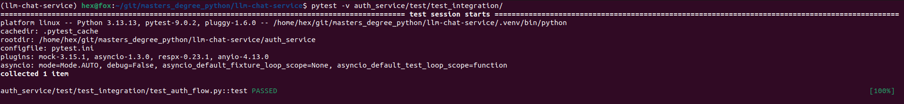

# Тестирование

## Модульные тесты

## Интеграционные тесты

## Отчет

### Общее резюме

Выполнены **модульные тесты** (unit) для функций безопасности (JWT и хеширование паролей) и 
**интеграционные тесты** (integration) для полного пользовательского сценария через HTTP. 
Покрыты как позитивные, так и негативные сценарии.

---

### 1. Модульные тесты (unit)

#### 1.1. Тестирование хеширования паролей (`test_password.py`)

| Требование из задания                                        | Что реализовано в тесте                                                                   | Статус  |
|--------------------------------------------------------------|-------------------------------------------------------------------------------------------|---------|
| Хеш не равен исходному паролю                                | `assert hashed_password != TEST_PASSWORD` в `test_positive`                               | ✅       |
| Правильный пароль проходит verify                            | `assert success is True` в `test_positive`                                                | ✅       |
| Неправильный пароль не проходит verify                       | `assert success is False` в `test_negative`                                               | ✅       |
| Один и тот же пароль даёт разные хеши, но оба верифицируются | `test_hash_password_is_deterministic_for_verification` — хеши разные, оба проходят verify | ✅       |

#### 1.2. Тестирование JWT токенов (`test_jwt_token.py`)

| Требование из задания                              | Что реализовано в тесте                                                        | Статус   |
|----------------------------------------------------|--------------------------------------------------------------------------------|----------|
| Создание access токена через `create_access_token` | `test_access_token`                                                            | ✅        |
| Декодирование через `verify_token`                 | `token_data = jwt_token.verify_token(...)`                                     | ✅        |
| Проверка наличия `sub` в payload                   | `assert token_data.sub == str(subject)`                                        | ✅        |
| Проверка наличия `role` в payload                  | `assert token_data.role == ROLE`                                               | ✅        |
| Проверка наличия `iat` (issued at)                 | `assert isinstance(token_data.iat, datetime)`                                  | ✅        |
| Проверка наличия `exp` (expiration)                | `assert isinstance(token_data.exp, datetime)`                                  | ✅        |
| Тестирование refresh токена                        | `test_refresh_token` — создание и верификация refresh токена                   | ✅        |
| Прокидывание исключения при истекшем токене        | `test_expired_token` — `sleep` + `pytest.raises(exceptions.TokenExpiredError)` | ✅        |

#### 1.3. Дополнительные модульные тесты JWT (`test_token_data.py`)

| Тестируемый аспект                                           | Реализация                             | Статус   |
|--------------------------------------------------------------|----------------------------------------|----------|
| Создание `AccessTokenData` через `TokenData.new`             | `test_new_access_token`                | ✅        |
| Создание `RefreshTokenData` через `TokenData.new`            | `test_new_refresh_token`               | ✅        |
| Сериализация `AccessTokenData`                               | проверка `model_dump()`                | ✅        |
| Валидатор добавляет дополнительные данные в payload          | `test_validator` с `**additional_data` | ✅        |
| Поле `payload` отсутствует в сериализации при `payload=None` | условная проверка                      | ✅        |

---

### 2. Интеграционные тесты (`test_auth_flow.py`)

#### 2.1. Подготовка окружения (`conftest.py`)

| Требование                                      | Реализация                                                         | Статус  |
|-------------------------------------------------|--------------------------------------------------------------------|---------|
| Поднятие FastAPI приложения в тесте             | фикстура `app` с `App(settings)`                                   | ✅       |
| Подмена базы на in-memory SQLite                | `DB__DB_TYPE: DBType.sqlite.value`, `DB__TEST_DB_PATH: ":memory:"` | ✅       |
| ASGI-клиент через `httpx`                       | фикстура `client` с `httpx.ASGITransport`                          | ✅       |
| LifespanManager для управления жизненным циклом | `async with LifespanManager(fastapi_app):`                         | ✅       |

#### 2.2. Позитивные сценарии

| Сценарий                                       | Эндпоинт              | Тест-функция          | Статус   |
|------------------------------------------------|-----------------------|-----------------------|----------|
| Регистрация пользователя                       | `POST /auth/register` | `_test_register`      | ✅        |
| Логин (form-data, OAuth2PasswordRequestForm)   | `POST /auth/login`    | `_test_login`         | ✅        |
| Получение данных пользователя с Bearer токеном | `GET /auth/me`        | `_test_me`            | ✅        |
| Обновление access токена                       | `POST /auth/refresh`  | `_test_refresh_token` | ✅        |

#### 2.3. Негативные сценарии

| Сценарий                                          | Ожидаемый статус   | Тест-функция                                     | Статус  |
|---------------------------------------------------|--------------------|--------------------------------------------------|---------|
| Повторная регистрация с тем же email              | `409 CONFLICT`     | `_test_register_conflict`                        | ✅       |
| Логин с неверным паролем                          | `401 UNAUTHORIZED` | `_test_login_fail` (wrong_password)              | ✅       |
| Логин с неизвестным email                         | `401 UNAUTHORIZED` | `_test_login_fail` (unknown@test.com)            | ✅       |
| GET /auth/me без токена                           | `401 UNAUTHORIZED` | `_test_me_fail(client, None)`                    | ✅       |
| GET /auth/me с неверным токеном                   | `401 UNAUTHORIZED` | `_test_me_fail(client, WRONG_TOKEN)`             | ✅       |
| GET /auth/me с refresh токеном (неправильный тип) | `401 UNAUTHORIZED` | `_test_me_fail(client, refresh_token)`           | ✅       |
| Обновление с access токеном (вместо refresh)      | `401 UNAUTHORIZED` | `_test_refresh_token_fail(client, access_token)` | ✅       |
| Обновление с невалидным токеном                   | `401 UNAUTHORIZED` | `_test_refresh_token_fail(client, WRONG_TOKEN)`  | ✅       |

---

## 3. Полнота покрытия требований

| Требование из задания                        | Покрыто?   |
|----------------------------------------------|------------|
| Модульные тесты на хеширование паролей       | ✅          |
| Модульные тесты на генерацию/верификацию JWT | ✅          |
| Проверка sub, role, iat, exp в JWT           | ✅          |
| Интеграционные тесты через HTTP              | ✅          |
| Подмена БД на in-memory SQLite               | ✅          |
| Полный поток: регистрация → логин → /auth/me | ✅          |
| Негативные тесты: 409, 401                   | ✅          |
