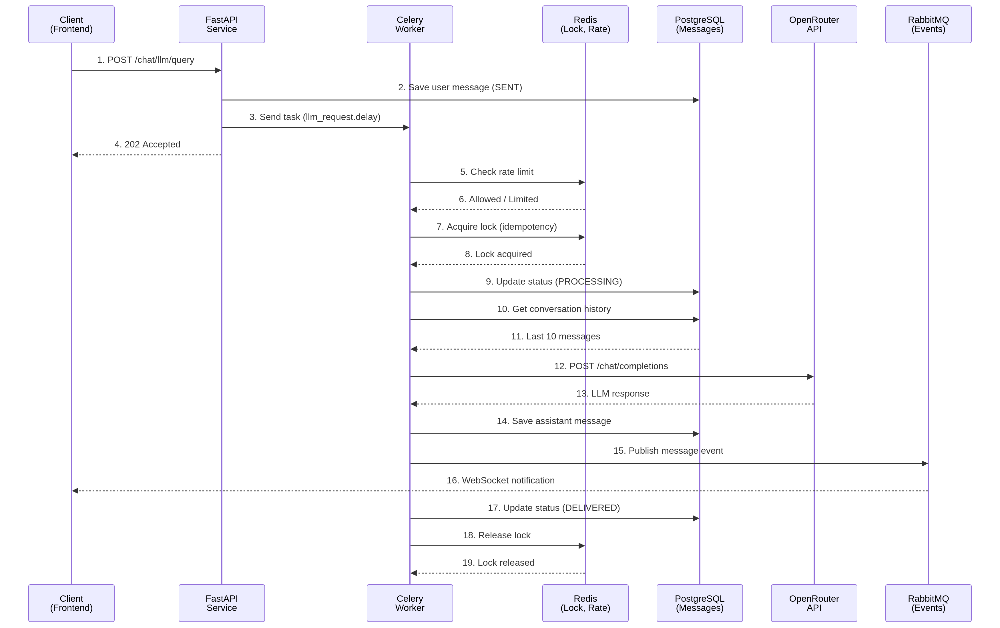

# Celery задача

Асинхронная Celery задача для обработки запросов к LLM (Large Language Model) через OpenRouter API с поддержкой 
идемпотентности, rate limiting и отказоустойчивости.

## Содержание

1. [Конфигурация Celery](#конфигурация-celery);
2. [Поток данных](#поток-данных);
3. [Сценарий обработки запроса](#сценарий-обработки-запроса); 

   3.1. [Инициализация](#инициализация);

   3.2. [Фоновая обработка](#фоновая-обработка);
4. [Публикация сообщения в RabbitMQ](#публикация-события-в-rabbitmq).

---

## Конфигурация Celery

Celery в данной системе сконфигурирован следующим образом:

| Параметр | Значение | Описание                                                                                                                                          |
|----------|----------|---------------------------------------------------------------------------------------------------------------------------------------------------|
| Broker   | RabbitMQ | Принимает и хранит задачи от FastAPI, распределяет их между Celery Worker'ами. Обеспечивает надежную доставку и persistence очередей.             |
| Backend  | Redis    | Сохраняет статусы выполнения задач, результаты успешных задач и исключения. FastAPI при необходимости может проверить статус задачи по task_id.   |

## Поток данных



## Сценарий обработки запроса

### Инициализация

**1. Клиент → FastAPI**

`POST /chat/llm/query` запрос от пользователя.

**2. FastAPI → PostgreSQL**

Сохранение данных сообщения пользователя в БД со статусом `SENT`.

**3. FastAPI → Celery**

Создание задачи для Celery на обработку пользовательского запроса.

**4. FastAPI → Клиент**

Возврат ответа со статусом `202 Accepted`.

### Фоновая обработка

**5. Celery → Redis (Rate Limit)**

Проверка, не превышен ли лимит запросов для данного пользователя/чата.

**7. Celery → Redis (Idempotency Lock)**

Попытка захватить блокировку (предотвращает повторную обработку).

**9. Celery → PostgreSQL**

Обновление статуса сообщения пользователя на `PROCESSING`.

**10. Celery → PostgreSQL**

Запрос последних 10 сообщений из истории диалога для формирования контекста запроса.

**12. Celery → OpenRouter API**

Отправка запроса `POST /chat/completions` с историей и новым сообщением.

**14. Celery → PostgreSQL**

Сохранение сообщение ассистента (role: assistant) со статусом `PROCESSING`.

**15. Celery → RabbitMQ**

Публикация события message.ready.

**17. Celery → PostgreSQL**

Обновление статуса исходного сообщения пользователя и сообщения ассистента с `PROCESSING` на `DELEVERED`.

**18. Celery → Redis**
Освобождает блокировку идемпотентности.

## Публикация события в RabbitMQ

При успешной обработке сообщения Celery Worker публикует событие в RabbitMQ со следующей структурой:

| Параметр        | Тип  | Описание                                                                  |
|-----------------|------|---------------------------------------------------------------------------|
| message_id      | UUID | Уникальный идентификатор сообщения ассистента, сохраненного в PostgreSQL. |
| conversation_id | UUID | Идентификатор диалога (беседы), к которому относится сообщение.           |
| user_id         | str  | Идентификатор пользователя, которому принадлежит диалог.                  |

**Пример сообщения:**

```json
{
  "message_id": "550e8400-e29b-41d4-a716-446655440000",
  "conversation_id": "6ba7b810-9dad-11d1-80b4-00c04fd430c8",
  "user_id": "user_12345"
}
```


