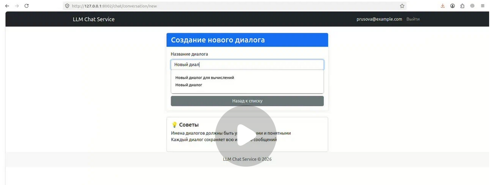
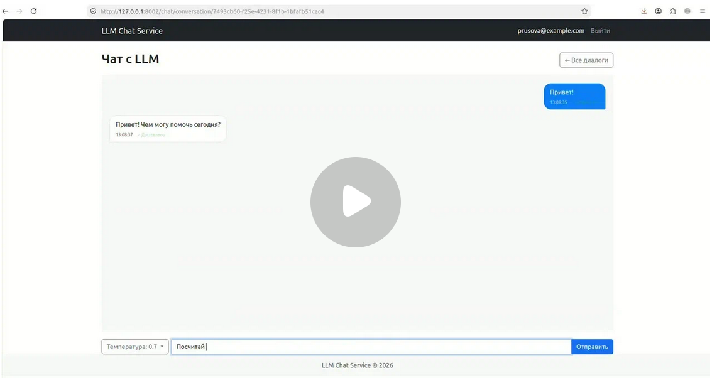
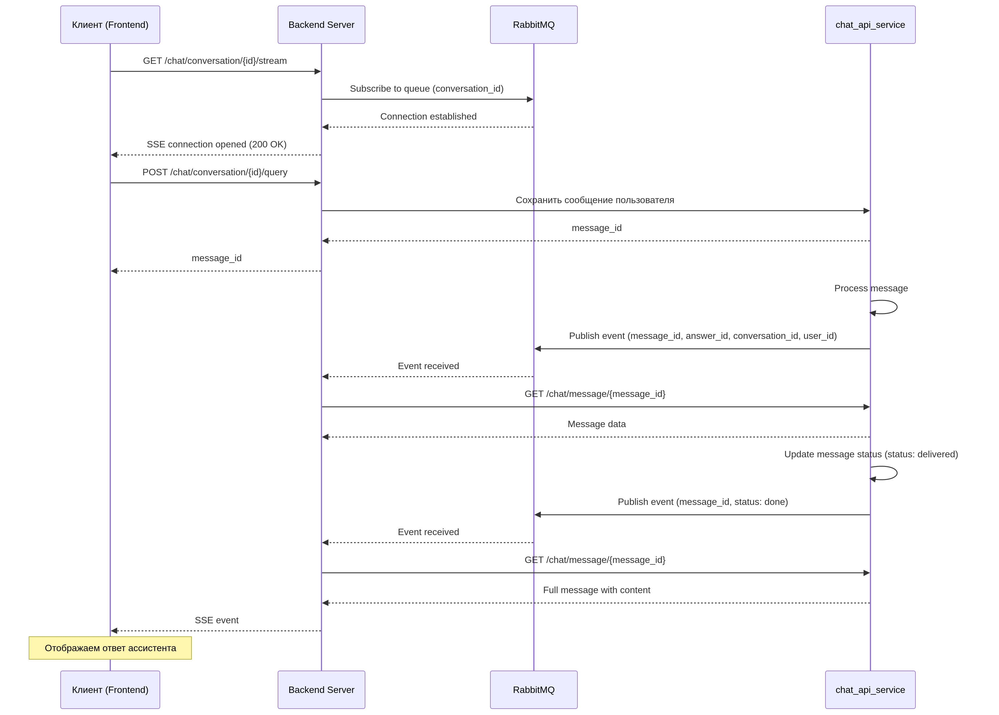

# Функционал пользователя

## Список диалогов

## Создание нового диалога

## Чат с LLM

Чат с пользователем работает по принципу SSE. 

SSE (Server-Sent Events) используется для доставки real-time уведомлений от сервера к клиенту. В данной архитектуре 
SSE работает в связке с RabbitMQ для асинхронной обработки сообщений.

### Процесс установки и работы SSE соединения:

1. **Установка соединения**

При загрузке страницы клиент устанавливает постоянное HTTP-соединение с сервером по маршруту: 
`GET /chat/conversation/{conversation_id}/stream`

2. **Подписка на события RabbitMQ**

Сервер подписывается на очередь RabbitMQ, связанную с конкретным conversation_id, и начинает прослушивать события, 
относящиеся к этому диалогу.

3. **Обработка событий**

При появлении нового события в очереди RabbitMQ:

    1. Сервер получает уведомление из очереди

    2. Сервер запрашивает полные данные сообщения у chat_api_service по маршруту: GET /chat/message/{message_id}

    3. Полученные данные сервер отправляет клиенту через SSE соединение

4. **Доставка клиенту**

Клиент отображает новое сообщение.

**Схема:**

