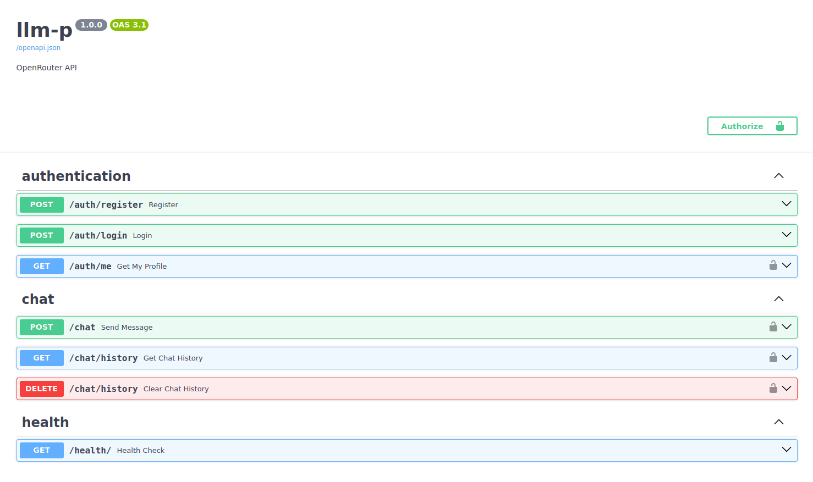

## Конфигурация

**Шаблон файла .env:**

```
# Основные настройки
APP_NAME=
ENV=
SQLITE_PATH=

# Настройки JWT токенов
JWT__SECRET=
JWT__ALG=
JWT__ACCESS_TOKEN_EXPIRE_MINUTES=

# Настройки подключения к сервису OpenRouter
OPENROUTER__API_KEY=
OPENROUTER__BASE_URL=
OPENROUTER__MODEL=
OPENROUTER__APP_NAME=
OPENROUTER__REFERER=
OPENROUTER__REQUEST_TIMEOUT=

# Настройки хэширования пароля
PASSWORD__PBKDF2_ITERATIONS=
PASSWORD__SALT_LEN=
PASSWORD__HASH_LEN=

# Настройки CORS
CORS__ENABLED=
CORS__ORIGINS=
CORS__METHODS=
CORS__HEADERS=
CORS__CREDENTIALS=
```
### Основные настройки

<table>
    <thead>
        <tr>
            <th>Название параметра</th>
            <th>Тип значения</th>
            <th>Значение по умолчанию</th>
            <th>Описание</th>
        </tr>
    </thead>
    <tbody>
        <tr>
            <td>APP_NAME</td>
            <td>str</td>
            <td>"llm-p"</td>
            <td>Название приложения</td>
        </tr>
        <tr>
            <td>ENV</td>
            <td>str</td>
            <td>"prod"</td>
            <td>Текущее окружение</td>
        </tr>
        <tr>
            <td>SQLITE_PATH</td>
            <td>str</td>
            <td>"./app.db"</td>
            <td>Путь к файлу SQLite базы данных</td>
        </tr>
    </tbody>
</table>

### Настройки JWT токенов

<table>
    <thead>
        <tr>
            <th>Название параметра</th>
            <th>Тип значения</th>
            <th>Значение по умолчанию</th>
            <th>Описание</th>
        </tr>
    </thead>
    <tbody>
        <tr>
            <td>secret</td>
            <td>str</td>
            <td>—</td>
            <td>Путь к ключу для JWT (обязательный параметр)</td>
        </tr>
        <tr>
            <td>alg</td>
            <td>str</td>
            <td>"HS256"</td>
            <td>Алгоритм подписи JWT токенов</td>
        </tr>
        <tr>
            <td>access_token_expire_minutes</td>
            <td>int</td>
            <td>60</td>
            <td>Время жизни access token в минутах</td>
        </tr>
    </tbody>
</table>

### Настройки подключения к сервису OpenRouter

<table>
    <thead>
        <tr>
            <th>Название параметра</th>
            <th>Тип значения</th>
            <th>Значение по умолчанию</th>
            <th>Описание</th>
        </tr>
    </thead>
    <tbody>
        <tr>
            <td>api_key</td>
            <td>Optional[str]</td>
            <td>—</td>
            <td>API ключ для OpenRouter</td>
        </tr>
        <tr>
            <td>base_url</td>
            <td>str</td>
            <td>"https://openrouter.ai/api/v1"</td>
            <td>Базовый URL OpenRouter API</td>
        </tr>
        <tr>
            <td>model</td>
            <td>str</td>
            <td>"stepfun/step-3.5-flash:free"</td>
            <td>Модель OpenRouter по умолчанию</td>
        </tr>
        <tr>
            <td>app_name</td>
            <td>Optional[str]</td>
            <td>"llm-fastapi-openrouter"</td>
            <td>Заголовок приложения для OpenRouter</td>
        </tr>
        <tr>
            <td>referer</td>
            <td>Optional[str]</td>
            <td>—</td>
            <td>Referer заголовок для запросов</td>
        </tr>
        <tr>
            <td>request_timeout</td>
            <td>int</td>
            <td>10</td>
            <td>Таймаут запроса в секундах</td>
        </tr>
    </tbody>
</table>

### Настройки хэширования пароля

<table>
    <thead>
        <tr>
            <th>Название параметра</th>
            <th>Тип значения</th>
            <th>Значение по умолчанию</th>
            <th>Описание</th>
        </tr>
    </thead>
    <tbody>
        <tr>
            <td>pbkdf2_iterations</td>
            <td>int</td>
            <td>600000</td>
            <td>Количество итераций для PBKDF2</td>
        </tr>
        <tr>
            <td>salt_len</td>
            <td>int</td>
            <td>32</td>
            <td>Длина соли в байтах</td>
        </tr>
        <tr>
            <td>hash_len</td>
            <td>int</td>
            <td>32</td>
            <td>Длина выходного хеша в байтах</td>
        </tr>
    </tbody>
</table>

### Настройки CORS

<table>
    <thead>
        <tr>
            <th>Название параметра</th>
            <th>Тип значения</th>
            <th>Значение по умолчанию</th>
            <th>Описание</th>
        </tr>
    </thead>
    <tbody>
        <tr>
            <td>enabled</td>
            <td>bool</td>
            <td>True</td>
            <td>Флаг включения CORS</td>
        </tr>
        <tr>
            <td>origins</td>
            <td>list[str]</td>
            <td>["*"]</td>
            <td>Список разрешенных источников</td>
        </tr>
        <tr>
            <td>methods</td>
            <td>list[str]</td>
            <td>["*"]</td>
            <td>Список разрешенных методов</td>
        </tr>
        <tr>
            <td>headers</td>
            <td>list[str]</td>
            <td>["*"]</td>
            <td>Список разрешенных заголовков</td>
        </tr>
        <tr>
            <td>credentials</td>
            <td>bool</td>
            <td>True</td>
            <td>Разрешить отправку куки</td>
        </tr>
    </tbody>
</table>

## Запуск

Перед запуском убедитесь, что в корневой директории проекта (рядом с файлом pyproject.toml) создан файл конфигурации 
*.env* с необходимыми параметрами конфигурации.

### 1. Установка uv

`uv` — это быстрый менеджер пакетов и инструмент для управления виртуальными окружениями. 
Если uv еще не установлен, установите его с помощью команды:

```shell
curl -LsSf https://astral.sh/uv/install.sh | sh
```

### Инициализация виртуального окружения

Создайте и синхронизируйте виртуальное окружение с зависимостями проекта:

```shell
uv sync
```

Эта команда создаст виртуальное окружение и установит все зависимости, указанные в `pyproject.toml`.

### Запуск сервера

Запустите сервер с помощью команды:

```shell
uv run uvicorn app.main:app --reload --host 0.0.0.0 --port 8000
```

**Параметры запуска**

| Параметр | Описание                        | Значение по умолчанию |
|----------|---------------------------------|-----------------------|
| host     | Хост сервера                    | 127.0.0.1             |
| port     | Порт сервера                    | 8000                  |

При успешном запуске в терминале появятся логи, аналогичные следующим:

```shell
uv run uvicorn app.main:app --reload --host 0.0.0.0 --port 8000
INFO:     Will watch for changes in these directories: ['/home/hex/git/masters_degree_python/llm-p']
INFO:     Uvicorn running on http://0.0.0.0:8000 (Press CTRL+C to quit)
INFO:     Started reloader process [17002] using WatchFiles
INFO:     Started server process [17004]
INFO:     Waiting for application startup.
INFO:     Application startup complete.
```

После запуска сервера перейдите в браузере по хосту `http://localhost:8000/docs`:



