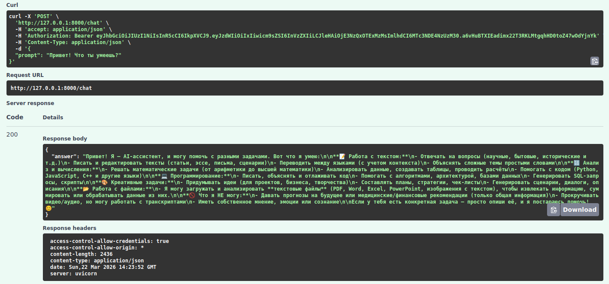

# Отправка сообщения в чат

Эндпоинт для отправки сообщения и получения ответа от языковой модели (OpenRouter).

## Request

**URL**: `POST /chat`

**JSON-body**:

| Параметр      | Тип     | Описание                                                 | Значение по умолчанию | Обязательный |
|---------------|---------|----------------------------------------------------------|-----------------------|--------------|
| promt         | string  | Тест запроса                                             | --                    | ✅            |
| system        | string  | Системная инструкция                                     | None                  | ❌            |
| max_history   | int     | Количество предыдущих сообщений из истории для контекста | 10                    | ❌            |
| temperature   | float   | Параметр креативности модели                             | 0.7                   | ❌            |

## Response

**200 - OK**:

Успешный ответ.

