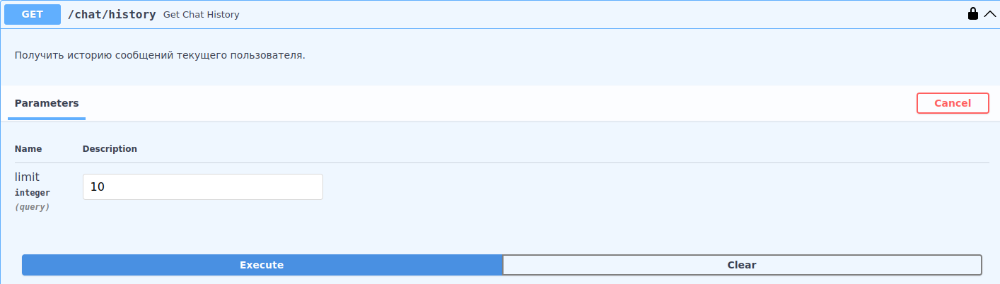
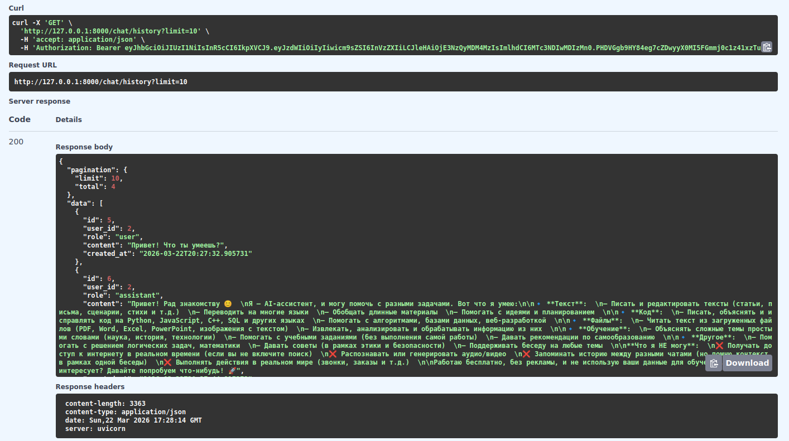

# Получение истории

Эндпоинт для получения истории диалогов текущего аутентифицированного пользователя.

## Request

**URL**: `GET /chat/history`

**JSON-body**:

| Параметр | Тип | Описание                          | Значение по умолчанию | Обязательный |
|----------|-----|-----------------------------------|-----------------------|--------------|
| limit    | int | Количество сообщений для возврата | 10                    | ❌            |

## Response

Успешный ответ.

