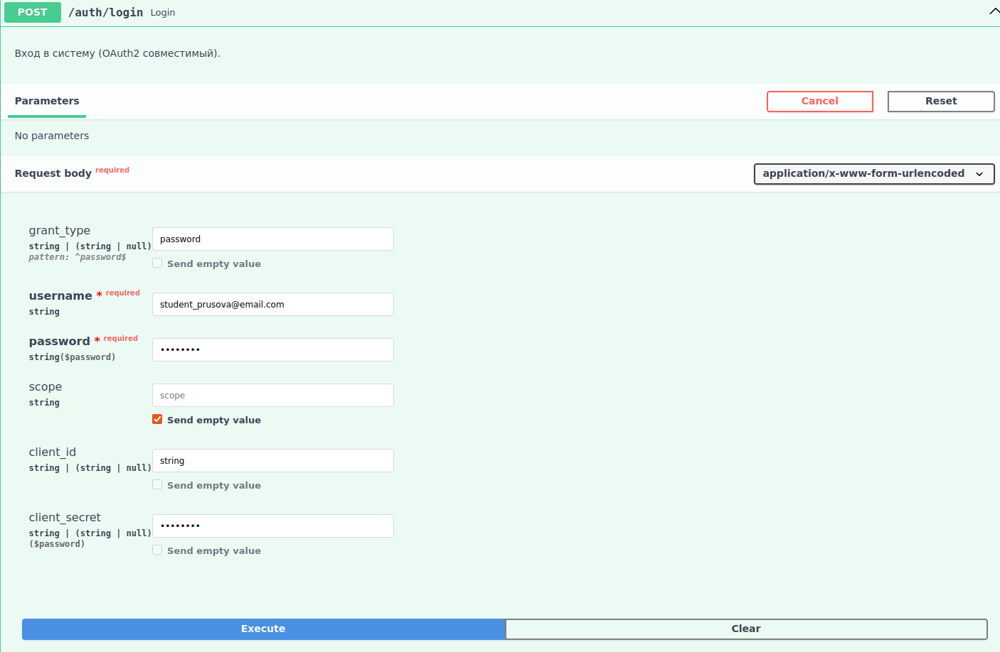
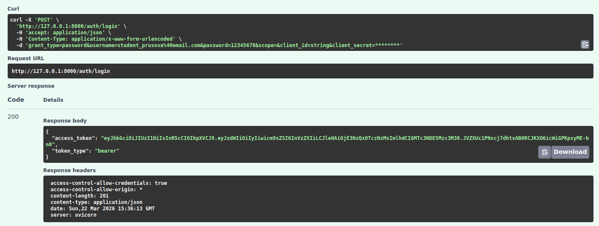
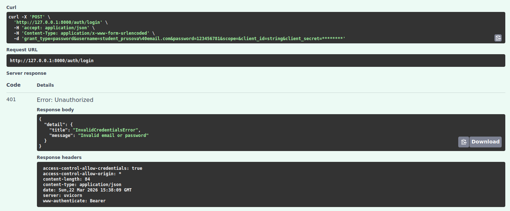

# Аутентификация пользователя

Эндпоинт для входа в систему и получения токена доступа. 
Реализован в соответствии со стандартом OAuth2.

## Request

**URL**: `POST /auth/login`

**JSON-body**:

| Параметр      | Тип     | Описание                                 | Значение по умолчанию | Обязательный |
|---------------|---------|------------------------------------------|-----------------------|--------------|
| username      | string  | Email пользователя                       | --                    | ✅            |
| password      | string  | Пароль пользователя                      | --                    | ✅            |
| grant_type    | string  | Тип авторизации                          | password              | ❌            |
| scope	     | string  | Области доступа (пробелами через пробел) | --          	      | ❌            | 
| client_id     | string  | Идентификатор клиента                    | --                    | ❌            |
| client_secret | string  | Секрет клиента                           | --                    | ❌            |

## Response

**200 - OK**:

Успешный ответ.

| Параметр   | Тип  | Описание                                                         |
|------------|------|------------------------------------------------------------------|
| id         | int  | ID пользователя                                                  |
| email      | str  | Email пользователя                                               |
| role       | str  | Роль пользователя (всем пользователям присваивается роль `user`) |
| created_at | str  | Дата и время регистрации пользователя                            |

**401 - Unauthorized**:

Указаны неверные учетные данные (email или пароль):

