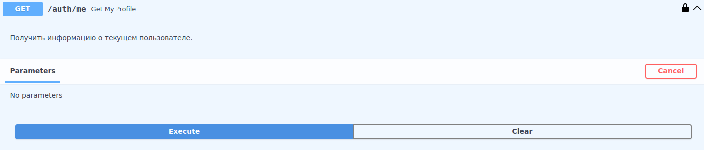
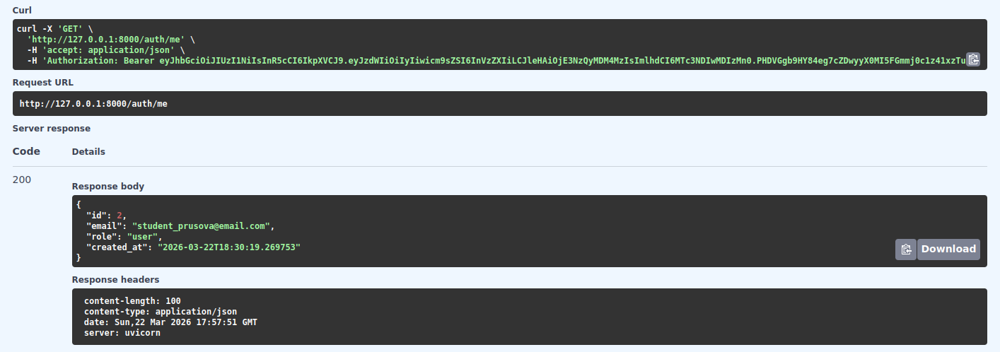

# Получение информации о текущем пользователе

Эндпоинт для получения данных профиля аутентифицированного пользователя.

## Request

**URL**: `GET /auth/me`

**Headers**:

| Параметр      | Тип | Описание  | Значение по умолчанию | Обязательный |
|---------------|-----|-----------|-----------------------|--------------|
| Authorization | str | JWT токен | --                    | ✅            |

## Response

**200 - OK**

Успешный ответ

