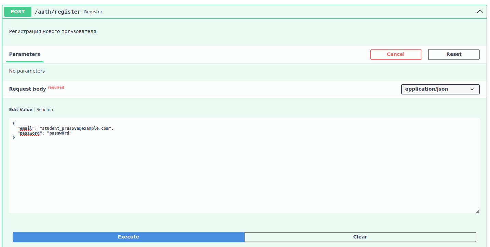
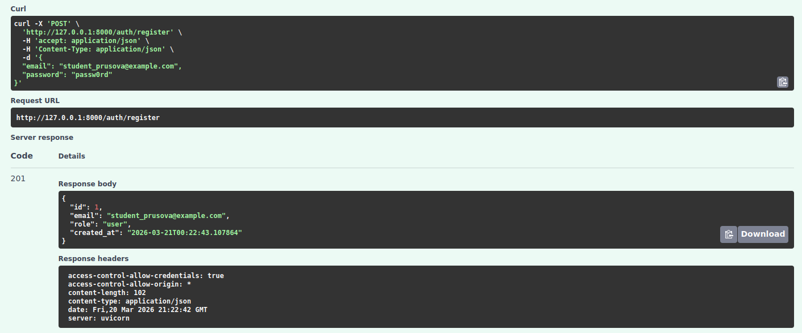
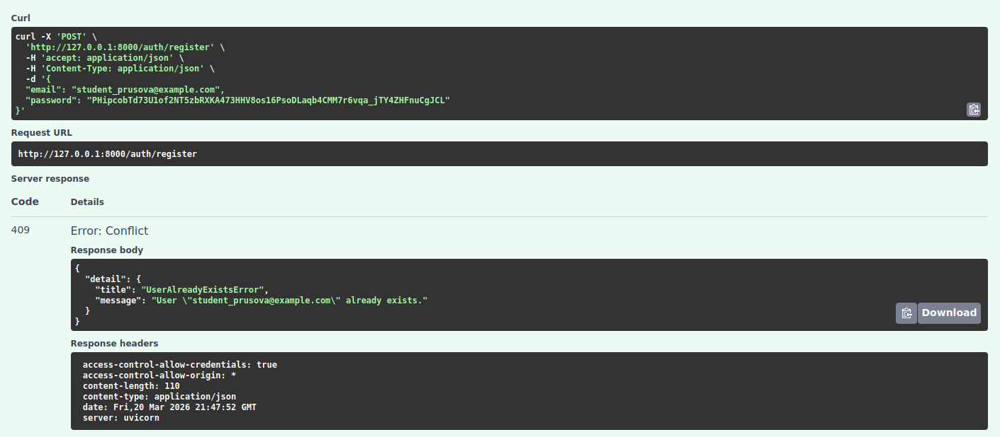

# Регистрация пользователя

Эндпоинт для создания нового пользователя в системе.

## Запрос:

**URL**: `POST /auth/register`

**JSON-body**:

| Параметр | Тип | Описание            | Значение по умолчанию |
|----------|-----|---------------------|-----------------------|
| email    | str | Email пользователя  | --                    |
| password | str | Пароль пользователя | --                    |

При успешной регистрации метод вернет статус `201` и следующие данные:

| Параметр   | Тип  | Описание                                                         |
|------------|------|------------------------------------------------------------------|
| id         | int  | ID пользователя                                                  |
| email      | str  | Email пользователя                                               |
| role       | str  | Роль пользователя (всем пользователям присваивается роль `user`) |
| created_at | str  | Дата и время регистрации пользователя                            |

## Ошибки регистрации

Если пользователь с указанным `email` уже существует, то метод вернет ответ со статусом `409`:

